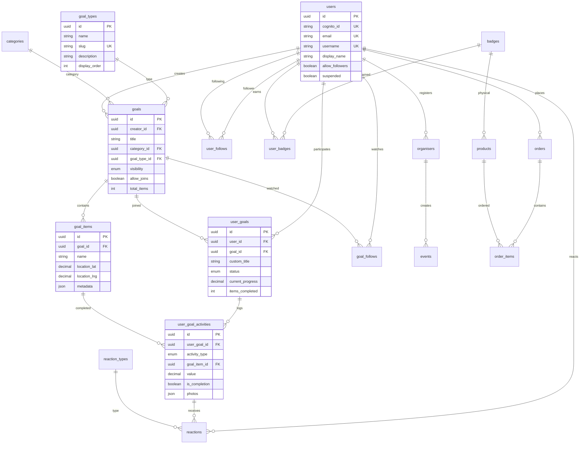

# The Goals Club - Database Schema

## Overview

Complete MySQL database schema for The Goals Club platform. This schema supports:
- **Template goals** (public/joinable) and **custom goals** (personal)
- **Collection goals** with tickable items (Wainwrights, National Trust sites)
- **Recurring goals** with progress tracking (run 5km/week)
- **Milestone goals** (complete by target date)
- **Event goals** (linked to organised events)

## Visual ERD

For an interactive visual diagram, paste the contents of [`schema.dbml`](./schema.dbml) into [dbdiagram.io](https://dbdiagram.io).

---

## Entity Relationship Diagram



---

## Lookup Tables

### goal_types
Goal type categories for consistent classification.

| Column | Type | Description |
|--------|------|-------------|
| id | UUID | Primary key |
| name | VARCHAR(50) | Display name (Milestone, Recurring, Collection, Event) |
| slug | VARCHAR(50) | URL-safe identifier |
| description | VARCHAR(200) | User-facing description |
| icon | VARCHAR(50) | Icon identifier |
| display_order | INT | Sort order |

**Seed Data:**
- `milestone` - Complete a single achievement or target
- `recurring` - Repeat an activity daily, weekly, or monthly
- `collection` - Tick off items from a list (peaks, sites, etc.)
- `event` - Participate in an organised event

### categories
Activity categories for grouping goals.

| Column | Type | Description |
|--------|------|-------------|
| id | UUID | Primary key |
| name | VARCHAR(100) | Display name |
| slug | VARCHAR(100) | URL-safe identifier |
| description | TEXT | Category description |
| icon | VARCHAR(50) | Icon identifier |
| color | VARCHAR(7) | Hex color code |
| display_order | INT | Sort order |
| active | BOOLEAN | Is category visible |

### reaction_types
Available reaction types for encouragement.

| Column | Type | Description |
|--------|------|-------------|
| id | UUID | Primary key |
| name | VARCHAR(50) | Reaction name (Cheer, High Five) |
| emoji | VARCHAR(10) | Emoji character |
| active | BOOLEAN | Is reaction available |
| display_order | INT | Sort order |

---

## Core Tables

### users
Profile data for registered users. Cognito handles authentication.

| Column | Type | Description |
|--------|------|-------------|
| id | UUID | Primary key (Cognito sub) |
| cognito_id | VARCHAR(128) | Cognito user ID |
| email | VARCHAR(255) | Email address (unique) |
| username | VARCHAR(50) | Optional display handle (for @mentions) |
| display_name | VARCHAR(100) | Display name |
| bio | TEXT | User biography |
| avatar_url | VARCHAR(500) | Profile image URL |
| location_lat | DECIMAL(10,8) | Latitude |
| location_lng | DECIMAL(11,8) | Longitude |
| location_name | VARCHAR(200) | Location display name |
| show_location | BOOLEAN | Show location on profile |
| allow_followers | BOOLEAN | Allow others to follow |
| follower_visibility | ENUM | Who can follow (friends, anyone) |
| default_visibility | ENUM | Default goal visibility |
| suspended | BOOLEAN | Admin-set suspension flag (default false) |

### goals
**Template goals** - public or community-created goals that users can join.

| Column | Type | Description |
|--------|------|-------------|
| id | UUID | Primary key |
| creator_id | UUID | FK to users.id |
| title | VARCHAR(200) | Goal title |
| description | TEXT | Goal description |
| category_id | UUID | FK to categories.id |
| goal_type_id | UUID | FK to goal_types.id |
| target_value | DECIMAL(10,2) | For recurring goals |
| target_unit | VARCHAR(50) | Unit (km, times, hours) |
| target_frequency | ENUM | daily, weekly, monthly, yearly, once |
| target_date | DATE | For milestone/event goals |
| visibility | ENUM | private, friends, public |
| allow_joins | BOOLEAN | Can others join (default: true) |
| total_items | INT | Cached item count for collections |
| image_url | VARCHAR(500) | Goal cover image |
| status | ENUM | active, archived |

### goal_items
Items within a collection goal (Wainwright peaks, National Trust sites).

| Column | Type | Description |
|--------|------|-------------|
| id | UUID | Primary key |
| goal_id | UUID | FK to goals.id |
| name | VARCHAR(200) | Item name (e.g., "Helvellyn") |
| description | TEXT | Item description |
| location_lat | DECIMAL(10,8) | Latitude for map |
| location_lng | DECIMAL(11,8) | Longitude for map |
| location_name | VARCHAR(200) | Location display name |
| external_id | VARCHAR(100) | External reference (Wainwright #) |
| metadata | JSON | Flexible data (elevation, etc.) |
| image_url | VARCHAR(500) | Item image |
| display_order | INT | Sort order |

### user_goals
User's participation in a goal - either **joined** (linked to goals) or **custom** (personal).

| Column | Type | Description |
|--------|------|-------------|
| id | UUID | Primary key |
| user_id | UUID | FK to users.id |
| goal_id | UUID | FK to goals.id (NULL for custom) |
| **Custom Goal Fields** (when goal_id is NULL): | | |
| custom_title | VARCHAR(200) | Personal goal title |
| custom_description | TEXT | Personal goal description |
| custom_category_id | UUID | FK to categories.id |
| custom_goal_type_id | UUID | FK to goal_types.id |
| custom_target_value | DECIMAL(10,2) | Personal target |
| custom_target_unit | VARCHAR(50) | Personal unit |
| custom_target_frequency | ENUM | Personal frequency |
| custom_target_date | DATE | Personal target date |
| **Tracking Fields**: | | |
| visibility | ENUM | private, friends, public |
| status | ENUM | active, completed, paused, abandoned |
| current_progress | DECIMAL(10,2) | Cached progress value |
| items_completed | INT | Cached completed items count |
| joined_at | TIMESTAMP | When user joined/created |
| completed_at | TIMESTAMP | When goal was completed |

**Key Design Decision:** 
- `goal_id IS NOT NULL` = User joined a template goal
- `goal_id IS NULL` = User created a custom/personal goal

### user_goal_activities
Activity logs for progress/visits/completions.

| Column | Type | Description |
|--------|------|-------------|
| id | UUID | Primary key |
| user_goal_id | UUID | FK to user_goals.id |
| activity_type | ENUM | item_completion, progress_log, visit |
| goal_item_id | UUID | FK to goal_items.id (for collections) |
| value | DECIMAL(10,2) | Progress value (for recurring) |
| unit | VARCHAR(50) | Value unit |
| activity_date | DATE | When activity occurred |
| is_completion | BOOLEAN | Marks item as ticked off |
| notes | TEXT | Activity notes |
| location_lat | DECIMAL(10,8) | Activity location |
| location_lng | DECIMAL(11,8) | Activity location |
| location_name | VARCHAR(200) | Location display name |
| photos | JSON | Array of photo URLs |

**Activity Types:**
- `item_completion` - Ticking off a collection item (requires goal_item_id, is_completion=true)
- `progress_log` - Logging progress (uses value, unit)
- `visit` - Recording a visit without completion (for repeat visits to NT sites)

---

## Social Tables

### user_follows
User-to-user following relationships.

| Column | Type | Description |
|--------|------|-------------|
| id | UUID | Primary key |
| follower_id | UUID | FK to users.id (who follows) |
| following_id | UUID | FK to users.id (who is followed) |
| created_at | TIMESTAMP | When followed |

**Unique constraint:** (follower_id, following_id)

### goal_follows
Following a goal without joining (spectator mode).

| Column | Type | Description |
|--------|------|-------------|
| id | UUID | Primary key |
| user_id | UUID | FK to users.id |
| goal_id | UUID | FK to goals.id |
| created_at | TIMESTAMP | When followed |

### reactions
Encouragement reactions on activities.

| Column | Type | Description |
|--------|------|-------------|
| id | UUID | Primary key |
| user_id | UUID | FK to users.id (who reacted) |
| activity_id | UUID | FK to user_goal_activities.id |
| reaction_type_id | UUID | FK to reaction_types.id |
| created_at | TIMESTAMP | When reacted |

---

## Badges & Achievements

### badges
Available badges for users to earn.

| Column | Type | Description |
|--------|------|-------------|
| id | UUID | Primary key |
| name | VARCHAR(100) | Badge name |
| description | TEXT | How to earn |
| image_url | VARCHAR(500) | Badge image |
| badge_type | ENUM | system, goal, event, category |
| category_id | UUID | FK to categories.id |
| goal_id | UUID | FK to goals.id (for goal-specific) |
| criteria | JSON | Earning criteria definition |
| is_limited_edition | BOOLEAN | Limited availability |
| active | BOOLEAN | Is badge available |

### user_badges
Badges earned by users.

| Column | Type | Description |
|--------|------|-------------|
| id | UUID | Primary key |
| user_id | UUID | FK to users.id |
| badge_id | UUID | FK to badges.id |
| user_goal_id | UUID | FK to user_goals.id (if earned via goal) |
| earned_at | TIMESTAMP | When earned |

---

## Events & Organisers

### organisers
Verified event organisers.

| Column | Type | Description |
|--------|------|-------------|
| id | UUID | Primary key |
| user_id | UUID | FK to users.id |
| organisation_name | VARCHAR(200) | Organisation name |
| description | TEXT | About the organiser |
| website_url | VARCHAR(500) | Website |
| logo_url | VARCHAR(500) | Logo image |
| status | ENUM | pending, approved, rejected, suspended, trusted |
| can_self_publish | BOOLEAN | Trusted to publish without review |
| approved_at | TIMESTAMP | When approved |
| approved_by | UUID | Admin who approved |

### events
Organised events (races, challenges, etc.).

| Column | Type | Description |
|--------|------|-------------|
| id | UUID | Primary key |
| organiser_id | UUID | FK to organisers.id |
| name | VARCHAR(200) | Event name |
| description | TEXT | Event description |
| category_id | UUID | FK to categories.id |
| event_date | DATE | Start date |
| event_end_date | DATE | End date (multi-day) |
| location_lat | DECIMAL(10,8) | Event location |
| location_lng | DECIMAL(11,8) | Event location |
| location_name | VARCHAR(200) | Location display name |
| external_url | VARCHAR(500) | Registration link |
| image_url | VARCHAR(500) | Event image |
| status | ENUM | draft, pending, approved, rejected, archived |

---

## E-Commerce Tables

### products
Physical badges, patches, pins for sale.

| Column | Type | Description |
|--------|------|-------------|
| id | UUID | Primary key |
| name | VARCHAR(200) | Product name |
| description | TEXT | Product description |
| price_pence | INT | Price in pence |
| image_url | VARCHAR(500) | Product image |
| badge_id | UUID | FK to badges.id (linked badge) |
| product_type | ENUM | badge, patch, pin, other |
| stock_quantity | INT | Available stock |
| stock_status | ENUM | in_stock, low_stock, out_of_stock, pre_order |
| is_limited_edition | BOOLEAN | Limited availability |
| active | BOOLEAN | Available for sale |
| stripe_product_id | VARCHAR(100) | Stripe product ID |
| stripe_price_id | VARCHAR(100) | Stripe price ID |

### orders
Customer orders.

| Column | Type | Description |
|--------|------|-------------|
| id | UUID | Primary key |
| user_id | UUID | FK to users.id |
| order_number | VARCHAR(20) | Human-readable order # |
| status | ENUM | pending, paid, processing, shipped, delivered, cancelled, refunded |
| subtotal_pence | INT | Subtotal in pence |
| shipping_pence | INT | Shipping cost |
| total_pence | INT | Total in pence |
| currency | VARCHAR(3) | Currency code (GBP) |
| stripe_payment_intent_id | VARCHAR(200) | Stripe payment ID |
| shipping_* | Various | Shipping address fields |
| tracking_number | VARCHAR(100) | Shipment tracking |
| tracking_url | VARCHAR(500) | Tracking URL |

### order_items
Line items in an order.

| Column | Type | Description |
|--------|------|-------------|
| id | UUID | Primary key |
| order_id | UUID | FK to orders.id |
| product_id | UUID | FK to products.id |
| quantity | INT | Quantity ordered |
| price_pence | INT | Price at time of order |

---

## System Tables

### notifications
User notifications.

| Column | Type | Description |
|--------|------|-------------|
| id | UUID | Primary key |
| user_id | UUID | FK to users.id |
| type | VARCHAR(50) | Notification type |
| title | VARCHAR(200) | Notification title |
| message | TEXT | Notification body |
| data | JSON | Additional data |
| read_at | TIMESTAMP | When read (NULL = unread) |

### audit_log
Admin action audit trail.

| Column | Type | Description |
|--------|------|-------------|
| id | UUID | Primary key |
| admin_user_id | UUID | Who performed action |
| action | VARCHAR(100) | Action type |
| entity_type | VARCHAR(50) | Affected table |
| entity_id | UUID | Affected record |
| old_values | JSON | Previous values |
| new_values | JSON | New values |
| ip_address | VARCHAR(45) | IP address |
| user_agent | TEXT | Browser/client info |

---

## Example Use Cases

### 1. Summit All Wainwrights (Collection Goal)

```sql
-- Template goal
INSERT INTO goals (id, creator_id, title, goal_type_id, category_id, visibility, allow_joins)
VALUES ('wainwright-goal-uuid', 'admin-uuid', 'Summit All 214 Wainwrights', 
        'collection-type-uuid', 'outdoor-challenges-uuid', 'public', true);

-- Goal items (214 peaks)
INSERT INTO goal_items (goal_id, name, location_lat, location_lng, metadata)
VALUES ('wainwright-goal-uuid', 'Helvellyn', 54.5272, -3.0165, '{"elevation": 950, "book": 1}');
-- ... 213 more peaks

-- User joins goal
INSERT INTO user_goals (user_id, goal_id, status)
VALUES ('user-uuid', 'wainwright-goal-uuid', 'active');

-- User summits Helvellyn
INSERT INTO user_goal_activities (user_goal_id, activity_type, goal_item_id, is_completion, activity_date, notes, photos)
VALUES ('user-goal-uuid', 'item_completion', 'helvellyn-item-uuid', true, '2026-03-01', 
        'Amazing views!', '["https://s3.../photo1.jpg"]');
```

### 2. Run 5km Every Week (Recurring Goal - Custom)

```sql
-- Custom personal goal (no template)
INSERT INTO user_goals (user_id, custom_title, custom_goal_type_id, custom_target_value, 
                        custom_target_unit, custom_target_frequency, visibility)
VALUES ('user-uuid', 'Run 5km weekly', 'recurring-type-uuid', 5.0, 'km', 'weekly', 'private');

-- Log a run
INSERT INTO user_goal_activities (user_goal_id, activity_type, value, unit, activity_date, notes)
VALUES ('user-goal-uuid', 'progress_log', 5.2, 'km', '2026-03-01', 'Morning park run');
```

### 3. Visit National Trust Sites (Collection with Repeat Visits)

```sql
-- User visits same NT site multiple times
INSERT INTO user_goal_activities (user_goal_id, activity_type, goal_item_id, is_completion, activity_date)
VALUES ('user-goal-uuid', 'item_completion', 'cragside-uuid', true, '2026-01-15'); -- First visit, ticks off

INSERT INTO user_goal_activities (user_goal_id, activity_type, goal_item_id, is_completion, activity_date)
VALUES ('user-goal-uuid', 'visit', 'cragside-uuid', false, '2026-03-01'); -- Return visit
```

